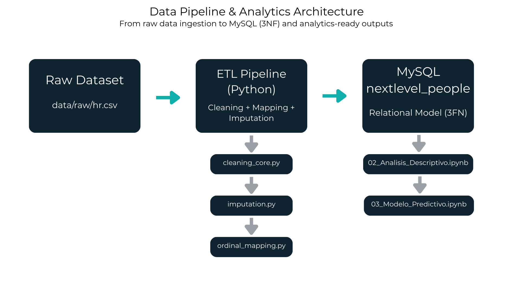
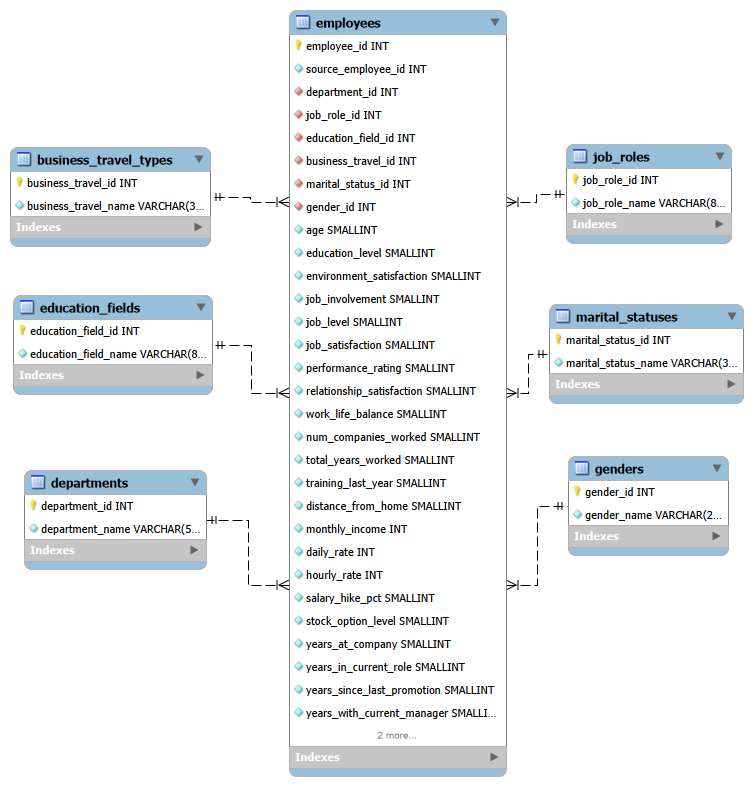

# Vertex Digital Solutions — HR Attrition Analytics

## End-to-End Data Pipeline, Relational Modelling & Predictive Analytics

Proyecto académico desarrollado por **Next Level People** como caso práctico de consultoría para Vertex Digital Solutions, en el marco de un programa formativo en Data Analytics.

📊 **Presentación Ejecutiva del Proyecto**

La presentación final del proyecto, incluyendo diagnóstico, modelización y plan estratégico, está disponible en el siguiente enlace:  
[Ver presentación en PDF](reports/slides/vertex_HR_Attrition_Presentation.pdf)

---

### 1. Contexto de Negocio

Vertex Digital Solutions detecta un aumento en la rotación de empleados (attrition) y necesita entender los factores que están impulsando la salida del talento. El objetivo no es únicamente analizar los datos existentes, sino construir una solución estructurada, reproducible y escalable que permita transformar información dispersa en conocimiento accionable.

La compañía solicita:

- Diagnóstico de los drivers de rotación.
- Estandarización y limpieza del dataset.
- Diseño de una base de datos relacional normalizada.
- Preparación para modelado predictivo.
- Recomendaciones estratégicas basadas en evidencia.

---

### 2. Objetivos del Proyecto

- Garantizar calidad y consistencia de datos.
- Diseñar un modelo relacional en Tercera Forma Normal (3FN).
- Construir un pipeline ETL reproducible en Python.
- Generar un dataset analíticamente robusto.
- Desarrollar un modelo predictivo de riesgo de attrition (en progreso).

---

### 3. Descripción del Dataset

Archivo original: data/raw/hr.csv  
Filas originales: 1474  
Columnas originales: 35  

Tras el proceso de limpieza:

Archivo procesado: data/processed/hr_processed.csv  
Filas finales: 1470  
Columnas finales: 31  
Variable objetivo: attrition (clasificación binaria: Yes/No)

El identificador original (employee_number) se conserva como source_employee_id en la base de datos para mantener trazabilidad.

---

### 4. Arquitectura de la Solución

Flujo completo del proyecto:

RAW CSV  
→ Data Cleaning & Feature Engineering (Python)  
→ Processed CSV  
→ MySQL Database (3FN)  
→ Exploratory Analysis  
→ Predictive Modelling  

La arquitectura separa claramente las fases de ingesta, transformación, almacenamiento y análisis.

#### Arquitectura del Pipeline de Datos



Este diagrama representa la separación entre las capas de ingesta, transformación, almacenamiento relacional y consumo analítico.

---

### 5. Estructura del Repositorio

```text
PROYECTO-DA-PROMO-64-MODULO-3-TEAM-2/
│
├── assets/
│ └── fonts/ # Tipografías utilizadas en visualizaciones y presentación
│ └── static/
│
├── data/
│ ├── raw/
│ │ └── hr.csv # Dataset original
│ └── processed/
│ └── hr_processed.csv # Dataset transformado y preparado para modelado y carga
│
├── docs/
│ ├── data_pipeline_architecture.png
│ ├── data_quality_report.md
│ └── edr_nextlevel_people.png # Diagrama entidad-relación (BBDD)
│
├── notebooks/
│ ├── 00_EDA.ipynb
│ ├── 01_Limpieza.ipynb
│ ├── 02_Análisis_Descriptivo.ipynb
│ └── 03_Análisis_Inferencial.ipynb
│
├── reports/
│ ├── figures/ # Visualizaciones exportadas
│ │ ├── 00_eda/
│ │ ├── 01_análisis_estadístico/
│ │ └── 02_análisis_inferencial/
│ └── slides/
│ └── vertex_HR_Attrition_Presentation.pdf
│
├── sql/
│ ├── 01_create_schema_nextlevel_people.sql
│ └── 02_eda_load_validation.sql
│
├── src/
│ ├── cleaning_core.py # Funciones principales de limpieza
│ ├── imputation.py # Tratamiento de valores nulos
│ ├── ordinal_mapping.py # Mapeo de variables ordinales
│ ├── load_mysql.py # Carga de datos en MySQL
│ ├── main.py # Orquestación del proceso
│ └── pipeline.py # Definición del flujo ETL
│
├── README.md # Documentación principal del proyecto
└── requirements.txt # Dependencias del entorno
```

---

### 6. Limpieza y Preparación de Datos

El pipeline implementa:

- Normalización de nombres de columnas a snake_case.
- Corrección de inconsistencias en valores categóricos.
- Estandarización de escalas ordinales (satisfacción, educación, job level, stock options, performance rating).
- Tratamiento de valores nulos según tipología de variable.
- Conversión explícita de tipos para asegurar consistencia en la carga a SQL.
- Preparación del dataset para análisis descriptivo y modelado predictivo.

La lógica de transformación se encuentra modularizada en src/cleaning_core.py, src/imputation.py y src/ordinal_mapping.py.

---

### 7. Diseño de Base de Datos (MySQL — 3FN)

Base de datos: nextlevel_people

Tablas dimensión:

- departments
- job_roles
- education_fields
- business_travel_types
- marital_statuses
- genders

Tabla principal:

employees

Incluye:

- employee_id (Primary Key autoincrement)
- source_employee_id (único para trazabilidad)
- Foreign Keys a tablas dimensión
- Variables numéricas y flags
- Restricciones CHECK para garantizar integridad de datos

El diseño en Tercera Forma Normal elimina redundancia y asegura consistencia relacional.

#### Diagrama Entidad-Relación (ERD)



Este diagrama refleja la estructura relacional normalizada y las relaciones entre la tabla principal y las tablas dimensión.

---

### 8. Pipeline ETL (Python)

El archivo src/main.py orquesta el flujo completo:

1. Lectura del CSV raw.
2. Ejecución del pipeline de limpieza.
3. Generación del CSV procesado.
4. Carga estructurada a MySQL mediante SQLAlchemy.

El sistema permite ejecutar el flujo completo de manera reproducible desde la raíz del proyecto.  
El diseño modular facilita la mantenibilidad, escalabilidad y reutilización del pipeline.

---

### 9. Análisis Exploratorio

Notebook: notebooks/02_Analisis_Descriptivo.ipynb

El análisis descriptivo tuvo como objetivo caracterizar el fenómeno de attrition antes de avanzar hacia la modelización explicativa.

Principales hallazgos:

- El attrition se concentra en etapas tempranas de carrera, especialmente en Entry Level y perfiles con menor seniority.
- Factores operativos como overtime, viajes frecuentes y baja satisfacción laboral muestran asociación recurrente con mayores tasas de salida.
- Variables estructurales como departamento, rol y nivel organizativo segmentan claramente el riesgo.
- La compensación económica influye principalmente en fases iniciales y contextos específicos, aunque no explica por sí sola el comportamiento global.
- Se observan fricciones potenciales en posicionamiento salarial, con solapamiento entre niveles jerárquicos.
- El clima organizacional agregado muestra relación significativa con el attrition.
- El fenómeno presenta naturaleza multifactorial, con combinaciones de variables que generan hotspots concretos.

Este análisis permitió establecer una base estructurada para la posterior modelización explicativa.

---

### 10. Modelado Predictivo

Notebook: notebooks/03_Modelo_Predictivo.ipynb

A partir de los hallazgos descriptivos, se desarrolló un enfoque explicativo orientado a comprender los drivers estructurales del attrition y estimar el riesgo asociado a cada perfil organizativo.

El proceso incluyó:

- Implementación de regresión logística para cuantificar la relación entre variables operativas y estructurales y la probabilidad de attrition.
- Interpretabilidad mediante análisis SHAP para identificar la contribución específica de cada variable tanto a nivel global como individual.
- Segmentación mediante clustering basado en patrones explicativos, permitiendo identificar perfiles organizativos con distintos niveles de exposición al riesgo.

Este enfoque permitió pasar de la identificación de correlaciones descriptivas a una comprensión estructurada de los factores que incrementan la probabilidad de abandono, habilitando perfiles de riesgo interpretables y accionables.

---

### 11. Impacto en el Negocio

El análisis descriptivo y la modelización explicativa permiten traducir los hallazgos técnicos en implicaciones estratégicas para la organización.

Principales aportaciones:

- Identificación de perfiles organizativos con distinto nivel de exposición al riesgo de attrition.
- Confirmación de que el fenómeno no es homogéneo, sino segmentado por rol, nivel y trayectoria profesional.
- Identificación de drivers estructurales asociados a mayor probabilidad de abandono (overtime, baja satisfacción, progresión limitada y condiciones del rol).
- Segmentación en clusters diferenciados que permiten priorizar intervenciones según perfil organizativo.

Estos resultados permiten pasar de una percepción general de “alta rotación” a una comprensión estructurada y segmentada del fenómeno, habilitando estrategias de retención dirigidas.

Las recomendaciones propuestas se organizan en corto, medio y largo plazo, combinando medidas de contención inmediata, estabilización organizativa y desarrollo estructural del talento.

---

### 12. Tecnologías Utilizadas

#### Programming & Data Processing

- Python 3.x
- Pandas
- NumPy

#### Data Visualization

- Matplotlib
- Seaborn

#### Machine Learning (in progress)

- Scikit-learn

#### Database & Data Modelling

- MySQL 8.x
- MySQL Workbench
- SQLAlchemy

#### Development & Version Control

- Jupyter Notebook
- Git
- GitHub

---

### 13. Limitaciones y Evolución del Proyecto

El proyecto implementa un pipeline completo end-to-end que integra análisis exploratorio, modelado predictivo, diseño de base de datos relacional y automatización mediante ETL.

No obstante, su evolución hacia un entorno productivo podría contemplar las siguientes mejoras estratégicas:

- Integración automática con fuentes dinámicas de datos para permitir actualizaciones periódicas sin intervención manual.
- Enriquecimiento del modelo predictivo mediante la incorporación de nuevas variables estratégicas (desempeño, clima organizativo, indicadores de productividad).
- Evolución hacia un enfoque de Machine Learning con reentrenamiento periódico y validación continua del rendimiento del modelo.
- Desarrollo de un dashboard interactivo (Power BI o Tableau) para facilitar la toma de decisiones en tiempo real por parte de dirección y RRHH.
- Implementación de validaciones automáticas de calidad de datos previas a la carga.
- Incorporación de logging estructurado y gestión segura de credenciales mediante variables de entorno.
- Inclusión de tests unitarios para reforzar la robustez y mantenibilidad del pipeline.

Estas líneas de evolución permitirían consolidar el proyecto como un sistema escalable, automatizado y plenamente integrado en la estrategia de gestión del talento.

---

### 14. Cómo Reproducir el Proyecto

1. Crear entorno virtual:

    python -m venv .venv

    Activación:

    Windows:
    .venv\Scripts\Activate.ps1

    Mac/Linux:
    source .venv/bin/activate

2. Instalar dependencias:

    pip install -r requirements.txt

3. Crear esquema MySQL ejecutando:

    sql/01_create_schema_nextlevel_people.sql

4. Ejecutar pipeline completo desde la raíz del proyecto:

    python src/main.py

Esto generará data/processed/hr_processed.csv y cargará las dimensiones y la tabla employees en la base de datos nextlevel_people.

Validación opcional:

sql/02_eda_load_validation.sql

---

### 15. Equipo — Next Level People

Scrum Master  
Valentina Castillo  
Coordinación & Metodología Ágil  
Planificación de sprints, organización del equipo y seguimiento estratégico del proyecto.  
[LinkedIn](https://www.linkedin.com/in/valentina-castillo-escobar-191863202/) | [GitHub](https://github.com/Valentina-Castillo)

Data Team  
Arantxa Barea  
Análisis & Modelado  
Exploración de datos, generación de insights, análisis exploratorio y predictivo.  
[LinkedIn](https://www.linkedin.com/in/arantxa-barea/) | [GitHub](https://github.com/arantxa-90)

Data Team  
Nieves Sánchez  
Arquitectura & Automatización  
Diseño de base de datos, estructuración del repositorio, desarrollo de la ETL y documentación.  
[LinkedIn](https://www.linkedin.com/in/nieves-sanchez-data) | [GitHub](https://github.com/nieves-sanchez)

---

### 16. Estado del Proyecto

Pipeline de datos: Completado  
Modelado de base de datos: Completado  
Análisis exploratorio: Completado
Modelado predictivo: Completado
Presentación final: Completado

---

### 17. Aviso Legal

Proyecto desarrollado con fines educativos y de portfolio.  
No contiene datos reales de empleados ni información sensible empresarial.
